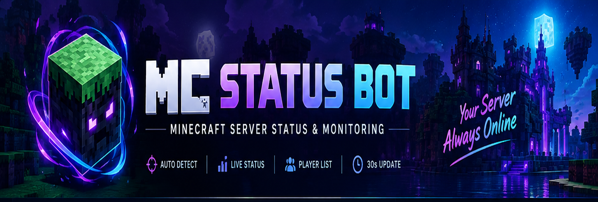

<div align="center">



# ⛏️ MC Status Bot

### Minecraft Server Status & Monitoring for Discord

[](https://nodejs.org/)
[](https://discord.js.org/)
[](https://www.minecraft.net/)
[](https://www.sqlite.org/)
[](LICENSE)

**Monitor Minecraft servers directly inside Discord with automatic server discovery, live status, player information, server favicon support, persistent monitoring, and a professional dashboard.**

</div>

---

## ✨ Features

- 🔎 **Automatic server lookup** — enter an IP and port and retrieve available server information automatically
- 🟢 **Live server status** — online/offline state, MOTD, version, ping, and player count
- 🎮 **Java & Bedrock support** — monitor both Minecraft editions
- 🖼️ **Automatic server favicon** — uses the Java server's own favicon when available, with a fallback icon
- 👥 **Player information** — displays the real player count and the player sample exposed by the server
- 🔄 **30-second auto-updating status channel** — edits one permanent Discord message every 30 seconds instead of creating spam
- 💾 **Persistent monitoring** — SQLite keeps servers, panels, settings, and statistics across restarts
- 🔔 **Online/offline alerts** — notifies when a monitored server actually changes state
- 📊 **Monitoring statistics** — uptime, peak/average players, average ping, checks, and downtime
- 🔘 **Interactive dashboard buttons** — Refresh, Players, Statistics, and Server Info
- 🌐 **Multi-server support** — monitor multiple Minecraft servers from one bot
- 🔐 **Secure configuration** — environment variables, host/port validation, and permission-protected administration

## 🎯 How It Works

A user can check any server without manually entering its name or icon:

```text
/status <ip> [port]
```

Example:

```text
/status play.example.com 25565
```

The bot queries the server and builds a dashboard from the information it receives:

```text
IP + PORT
   ↓
Minecraft Status Query
   ↓
┌─────────────────────────────┐
│ Server Name / MOTD          │
│ Server Favicon              │
│ Java / Bedrock              │
│ Version                     │
│ Players                     │
│ Player Sample               │
│ Ping                        │
└─────────────────────────────┘
   ↓
Professional Discord Dashboard
```

No manual server logo upload is required for Java servers that expose a favicon.

## 🔄 Automatic Status Channel

The bot can maintain a permanent status panel in a Discord channel.

After `/setup-status`, the bot:

1. Saves the channel and message ID.
2. Checks the Minecraft server.
3. Updates the dashboard.
4. Edits the **same Discord message**.
5. Repeats every **30 seconds** by default.

```env
UPDATE_INTERVAL_MS=30000
```

This prevents the status channel from filling with hundreds of messages.

## 🖥️ Dashboard

The dashboard is designed around a clean dark Minecraft/Discord interface and can display:

```text
🟢 ONLINE

Server Name
MOTD / Description

👥 Players       📡 Ping        🎮 Version
42 / 200         38ms           1.21.x

Minecraft Java Edition

🌐 play.example.com:25565

ONLINE PLAYERS
• PlayerOne
• PlayerTwo
• PlayerThree

Last updated: 12:30:30
```

Offline servers receive a separate state:

```text
🔴 OFFLINE

Players: —
Ping: —
Version: —

Server is currently unreachable.
```

The bot does not present stale player counts as live information.

## 👥 Player List Accuracy

Minecraft's standard status protocol does **not guarantee a complete player-name list**.

Java servers may expose only a player sample, and Bedrock status responses do not provide the same player-sample information.

Therefore this bot:

- Always displays the server's reported player count.
- Displays player names only when the server exposes them.
- Does not invent missing players.
- Treats the returned names as a **sample**, not a guaranteed full roster.
- Is structured for a future RCON or server-plugin integration if an exact roster is required.

## 🤖 Commands

| Command | Description | Permission |
|---|---|---|
| `/status` | Look up a Minecraft server by IP and optional port | Everyone |
| `/server add` | Add a server to persistent monitoring | Manage Server |
| `/server remove` | Remove a monitored server | Manage Server |
| `/server list` | List configured servers | Everyone |
| `/servers` | Show a quick overview of monitored servers | Everyone |
| `/setup-status` | Create a permanent auto-updating status panel | Manage Server |
| `/status-config` | Configure status panel settings | Manage Server |
| `/status-refresh` | Immediately refresh a panel | Everyone |
| `/status-stop` | Stop automatic panel updates | Manage Server |
| `/players` | Show available online player information | Everyone |
| `/ping` | Check server latency | Everyone |
| `/stats` | View monitoring statistics | Everyone |
| `/help` | Show available commands | Everyone |

### Interactive Controls

```text
[ 🔄 Refresh ] [ 👥 Players ]
[ 📊 Statistics ] [ 📋 Server Info ]
```

## 🛠️ Tech Stack

| Technology | Purpose |
|---|---|
| **Node.js 18+** | Runtime |
| **Discord.js v14** | Discord bot framework |
| **minecraft-server-util** | Minecraft Java/Bedrock status queries |
| **@napi-rs/canvas** | Professional dashboard rendering |
| **better-sqlite3** | Persistent monitoring and statistics |
| **dotenv** | Environment configuration |

## 📁 Project Structure

```text
mc-status-bot/
├── assets/
│   ├── banner.png
│   └── fonts/
├── data/
├── src/
│   ├── commands/
│   ├── events/
│   ├── services/
│   │   ├── database/
│   │   ├── minecraft/
│   │   └── monitoring/
│   ├── ui/
│   └── utils/
├── .env.example
├── .gitignore
├── LICENSE
├── package.json
└── README.md
```

## 🚀 Installation

### 1. Clone the repository

```bash
git clone https://github.com/resath1220/mc-status-bot.git
cd mc-status-bot
```

### 2. Install dependencies

```bash
npm install
```

### 3. Create `.env`

```bash
cp .env.example .env
```

On Windows PowerShell:

```powershell
Copy-Item .env.example .env
```

### 4. Configure Discord

Set your Discord bot credentials in `.env`:

```env
DISCORD_TOKEN=
CLIENT_ID=
GUILD_ID=
```

### 5. Register commands

```bash
npm run register
```

### 6. Start the bot

```bash
npm start
```

## ⚙️ Configuration

The default monitoring interval is:

```env
UPDATE_INTERVAL_MS=30000
```

This means the status panel refreshes every **30 seconds**.

Keep secrets such as `DISCORD_TOKEN` inside `.env`. Never commit your real `.env` file.

## ☁️ Hosting

The bot is suitable for long-running Node.js hosting such as:

- VPS
- Railway
- Render
- Pterodactyl
- Linux/Windows servers
- Other Node.js hosting platforms

For reliable 24/7 monitoring, use a host that keeps the Node.js process running continuously.

## 🔐 Security

Never publish:

```text
.env
Discord bot tokens
API keys
Private credentials
```

The project uses `.gitignore` to help keep `.env` and runtime database files out of Git.

Host and port inputs are validated before network requests, and administrative commands use Discord permissions.

If a Discord bot token is exposed, reset it immediately in the Discord Developer Portal.

## 🩺 Troubleshooting

**Commands do not appear**

```bash
npm run register
```

If using guild-scoped registration, make sure `GUILD_ID` is correct.

**Server shows offline**

Check the hostname, port, firewall, DNS, and whether the Minecraft server is publicly reachable.

**Favicon is unavailable**

Not every server exposes a favicon. Java servers without one use the fallback icon.

**Player names are unavailable**

This is normal when the server does not expose player samples and for Bedrock status queries.

**Status panel does not update**

Make sure the bot has permission to view the channel, send messages, embed links, and attach files.

## 🔎 SEO Keywords

`minecraft discord bot` · `minecraft server status bot` · `discord minecraft bot` · `minecraft server monitor` · `minecraft server monitoring` · `minecraft java status` · `minecraft bedrock status` · `minecraft discord server status` · `minecraft player count bot` · `minecraft ping bot` · `node.js discord bot` · `discord.js minecraft bot` · `multi-server minecraft monitor` · `minecraft server dashboard`

## 📄 License

This project is licensed under the **MIT License**.

See the [LICENSE](LICENSE) file for the full license text.

---

<div align="center">

⭐ **Star this repository if it helps your Minecraft community!**

Built with ❤️ for Minecraft server owners and Discord communities.

**Build • Monitor • Stay Connected**

</div>
